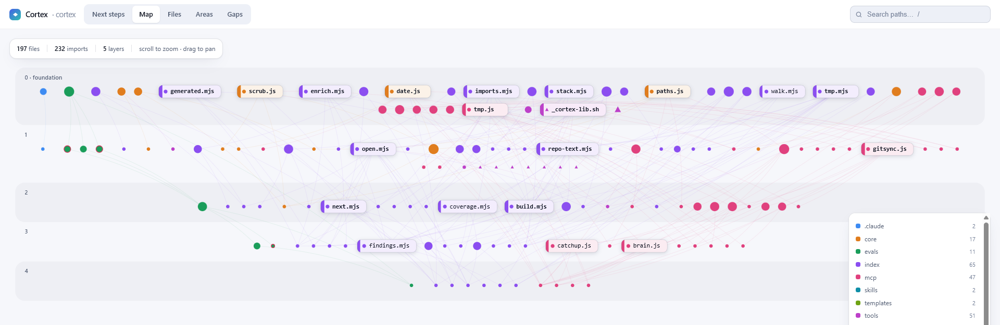

# 🧠 Cortex — a context manager for new and legacy codebases

**v2.38.0** · installable as a Claude plugin · see [CHANGELOG.md](CHANGELOG.md)

Point Cortex at a repository — new or legacy, yours alone or one a whole team shares — and it
builds real knowledge of it: what is there, how it is wired, where it is changing, and what is
missing. Then it writes the context layer every developer's agent reads.



**Three steps:**

```
/plugin marketplace add marinvch/Cortex
/plugin install cortex
/cortex          # inside the repo you want it to serve
```

**What lands in your repo:**

- **A findings report** — issues, gaps and recommendations, ranked. Nothing changes until you pick.
- **A small root `AGENTS.md`** with a routing table, scoped briefs where an area earns one, and
  shims so Claude, Gemini, Copilot and Cursor all read the same file.
- **A domain glossary and decision records** — `CONTEXT.md` and `docs/adr/`.
- **A committed team memory** — `.cortex/memory/`, so what one developer learned reaches the rest.

**Every conclusion is a proposal.** Indexing and reporting cannot modify your repository; a
separate, explicitly invoked skill applies what you choose. The user decides, not the AI.

**No build step, no engine** — plain markdown and a little Node, readable by any editor and by any
AI agent (Claude, Gemini, Copilot, Cursor).

Use it alone on your own repos, or on a team: the context layer is committed with the code, so
every developer's agent reads the same map and `.cortex/memory/` carries what one person learned to
the rest.

---

## Install as a Claude plugin ⭐

Cortex is a **context manager for new and legacy codebases**. Install it once, run it in any repo:

```
/plugin marketplace add marinvch/Cortex
/plugin install cortex
```

Then, inside the repo you want it to serve — a working project or an empty one:

```
/cortex
```

It indexes the codebase, writes **one findings report** — issues, gaps, recommendations, ranked —
works out which parts of the development loop the repo is missing (a verification block in
`CLAUDE.md`, a verifier subagent, `REVIEW.md`, hooks, an `intent/` home, evals, control bands), and
then **stops and asks once**. Nothing in your repo is modified until you pick what to act on.
Indexing and reporting are read-only by construction: a different skill applies changes.

### The order, and how to stop guessing at it

A list of commands is a menu, not an answer. **`/cortex-next` reads the repo you are standing in
and tells you the one command to run now** — every ✓ traced to a file on disk, never to something
a model thinks it did last session:

```
/cortex-next
```

```
  ✓ Index the codebase              .cortex/index/index.json is present
  ✓ Read the ranked findings        .cortex/findings/2026-08-23.md
  · See the repo as a graph         (optional)  see below
  → Write the context layer         root AGENTS.md, the shims, CONTEXT.md, docs/adr/
                                    /cortex-scaffold
    Give critical areas a brief     /cortex-brief <dir>
    Add skills that fit this stack  /cortex-skills
```

Every CLI prints that same `Next →` line when it finishes, so the sequence is never something you
have to come back here to look up. The full sequence, in order:

| # | Command | Does | Skip it when |
|---|---|---|---|
| 0 | `/migrate-engine` | harvest a retired `.ai-os/` engine's memory first | there is no `.ai-os/` |
| 1 | `/cortex` | index → findings → the loop → one confirmation → everything below, in one pass | never — this is the entry point |
| 2 | `/cortex-view` | the repo as one offline HTML page: map, files, areas, gaps | you would rather read the report |
| 3 | `/optimize-context` | slim the `AGENTS.md`/`CLAUDE.md`/`.cursorrules` that were already here | the repo had none |
| 4 | `/cortex-scaffold` | write the context layer you picked | — |
| 5 | `/cortex-brief <dir>` | a scoped `AGENTS.md` leaf per area that earns one | no area holds real invariants |
| 6 | `/cortex-skills` | skills proposed from what the index detected | — |
| 7 | `/cortex-enrich` | semantic summaries on top of the index (costs tokens) | you already know the repo |
| — | `/cortex-install` | the read half of step 1 alone: index, report, offer the context layer | you want the whole pass |
| 8 | `/dream` | end-of-day digest into the repo's committed `.cortex/memory/` | — |

**Step 3 goes before step 4, not after.** `/cortex-scaffold` is brownfield-safe and will not
clobber a curated `AGENTS.md` — which means you end up with your file *plus* an
`AGENTS.generated.md` and a merge to do by hand. Slimming first leaves one file.

And per change, which is a lookup rather than a sequence:

| When | Run |
|---|---|
| starting a risky feature | `/analyze-spec` |
| before touching files | `/cortex-impact <files>` |
| before committing | `/cortex-review` |
| chasing a bug you cannot explain | `/diagnosing-bugs` |
| back after time away | `/catch-me-up` |

What lands in the target repo:

```
AGENTS.md          small root brief + a routing table
CLAUDE.md GEMINI.md   one-line shims
CONTEXT.md         the domain glossary
docs/adr/          decisions, created lazily
<area>/AGENTS.md   scoped leaves, only where you accepted one
.cortex/
  index/           generated, gitignored
  findings/        generated, gitignored
  view/            generated, gitignored — the HTML graph
  memory/          COMMITTED — shared context, secrets refused at the gate
```

### See the repo, don't read about it

```
/cortex-view
```

That is the whole command, in any repo where the plugin is installed. It is a skill rather than a
node line because `${CLAUDE_PLUGIN_ROOT}` is only set *inside* a skill — typed in your own terminal
it expands to nothing, and the real path underneath it is pinned to the installed version, so it
breaks on the next update. From a clone of this repo, `node index/cortex-view.mjs .` is the same
thing.

One self-contained page — no server, no CDN, no runtime. The data is inlined, so it works offline
and copies anywhere. Seven tabs:

- **Overview** — the state of the repo on one screen: whether the index is fresh, which profile is
  serving, how far team memory trails the code; files, import edges, test coverage, 30-day churn and
  findings by severity; the import graph as a slowly turning cloud (click a point to open the file);
  the next commands to run, one click to copy; and a timeline of memory entries and commits. A fact
  that could not be read says *not available* and why — never a zero.
- **Map** — a force graph of every code file, coloured by area, laid out by import depth so it
  reads top-down instead of as a hairball. Click an area in the legend to hide it; a red ring means
  no test was found. Markdown and config stay out of the Map on purpose: they have no imports to
  draw, and on this repo 171 of them buried the 98 files that do.
- **Structure** — what an agent is handed: root `AGENTS.md`, the docs beside it, every code area
  with its scoped brief, busiest files and tests, and what Cortex generates. Missing pieces are
  drawn dashed, with the command that writes them.
- **Files** — every file with who imports it and what it imports, both clickable.
- **Areas** — the top-level shape, and which areas already have a scoped brief.
- **Gaps** — orphans, import cycles, and the busiest code with no test found, ranked by commits.
- **Next steps** — the sequence above, with your repo's position marked.

It follows your OS theme, with a button to override it, and every word on it clears 7:1 contrast
at 13px or larger — computed in the tests, not tuned by eye.

Orphans are stated as questions, never as a delete list: import resolution is regex-based
(ADR 0004 — a plugin install runs no build, so there is no parser), which makes dynamic imports
invisible. Same for coverage — a file exercised only through a subprocess reads as untested, which
is the safe direction to be wrong in.

Run `/cortex-enrich` first and each file card also carries what that file *does*.

The indexer is deterministic and offline — it asks git what belongs to the repo, resolves imports,
finds hot spots from history. **From a clone of this repo** you can run the CLIs directly — inside a
skill, prefix each with `${CLAUDE_PLUGIN_ROOT}/`:

```bash
node index/cortex-next.mjs .       # where this repo is; writes nothing at all
node index/cortex-index.mjs .      # writes .cortex/index/index.json
node index/cortex-findings.mjs .   # writes .cortex/findings/<date>.md
node index/cortex-view.mjs .       # writes .cortex/view/repo.html and opens it
node index/cortex-enrich.mjs plan . # optional: plan the semantic enrichment pass
```

---

---

## The personal vault (the other half)

Cortex began as a personal second brain, and that half still works — the rituals below manage a
markdown vault of your own notes, projects and daily logs.

It is **being extracted into its own private repo**, so that this one is purely the shippable
context manager. Everything from here down describes that half:

```bash
bash tools/cortex-vault-extract.sh --to ~/cortex-brain          # preview, changes nothing
bash tools/cortex-vault-extract.sh --to ~/cortex-brain --apply  # copy it out
```

An optional **personal vault** — notes, decisions, a daily log — is served by the same
rituals, and lives in its own private repo, never in this one.

> One rule: capture first, organize later. Nothing lives only in your head.

Since v1.1.0 there is also an **optional** Node MCP server in `mcp/` that turns the vault into live
`recall`/`capture` tools for MCP-speaking agents. It is strictly additive: everything below works
without installing it, and nothing in the vault depends on it.

### Vault quick start (5 minutes)

**1. Get the vault** — its own folder, never the Cortex checkout
```bash
git clone https://github.com/marinvch/Cortex.git
mkdir ~/cortex-brain
cp -r Cortex/templates/vault/. ~/cortex-brain/       # the empty skeleton: folders, connections, voice
cp Cortex/templates/home.md ~/cortex-brain/home.md   # your personal map
```
The rituals come from the plugin (`/plugin install cortex`, above), so they are available in the
vault folder without copying anything else in.

**2. Teach the brain who you are** — in Claude Code / Cowork, from the vault folder, run:
```
/onboard
```
It interviews you and fills `context/` (about you, priorities, how you work), `connections.md` and
`references/voice.md`. It copies in any part of the skeleton the vault is missing, and the vault's
`AGENTS.md` manual, so step 1's `cp -r` is a head start rather than a requirement.

**3. Use it daily**
```
/capture        # drop any thought into the inbox (anytime)
/daily          # start today's note; see priorities + what's due (each morning)
/weekly-review  # empty the inbox, update projects, archive stale (Fridays)
```

**4. See your whole brain**
```bash
bash tools/cortex.sh                  # builds cortex.html and opens it
```
One page, four tabs: **Map** (an Obsidian-style force graph — click a node to read it),
**Notes** (rendered markdown; click `[[wikilinks]]` to navigate; 🗑 to remove a note),
**Repos** (your registered codebases), **Gaps** (orphan notes + dead links to fix).

---

## Connect the live brain (MCP)

The skills above work by editing plain files. If your agent speaks **MCP** (Claude Code, Cursor,
etc.), you can also wire the vault up as a live server so `recall`/`capture` become real tools —
available in **every project on this machine**, not just this repo. One-time, user scope:

```bash
# no install step — the server has no dependencies
claude mcp add --scope user ai-os --env AI_OS_ROOT=/path/to/ai-os -- node /path/to/ai-os/mcp/server.js
```

**Cursor / other MCP agents** — add to the agent's `mcpServers` config:
```json
{ "ai-os": { "command": "node", "args": ["/path/to/ai-os/mcp/server.js"], "env": { "AI_OS_ROOT": "/path/to/ai-os" } } }
```

`AI_OS_ROOT` (this vault's path) is the only configuration — nothing else to set. Say "connect the
brain" (or run `/connect-brain`) to have your agent do this for you.

---

## Use it on your other projects ⭐

This is the part that makes any AI coding agent faster and safer on a specific codebase.

**Step 1 — open the project repo** (in Claude Code / Cowork, or a terminal).

**Step 2 — give it a brain.** Two options:

- **Deep (recommended), AI-driven** — in Claude Code / Cowork, run:
  ```
  /install-project
  ```
  It reads the actual code and writes a real `AGENTS.md` (stack, architecture, conventions,
  gotchas) + agent shims + `/plan-feature` and `/investigate-bug` skills.

- **Fast, deterministic** — from a terminal inside the repo:
  ```bash
  bash /path/to/ai-os/tools/cortex-init.sh
  ```
  Detects the stack (package manager, framework, language, scripts, tsconfig, lint/CI, source dirs),
  scaffolds `AGENTS.md` + shims + skills, and **suggests relevant skills** for your stack.

**Step 3 — if the repo has an OLD engine** (`.ai-os/`, `.github/ai-os/`): both paths detect it and
tell you to run **`/migrate-engine`** first — it harvests the old memory into `AGENTS.md`, then
removes the cruft, so no knowledge is lost.

**Step 4 — register it with your vault** (optional, metadata only — no code leaves the repo):
```bash
bash /path/to/ai-os/tools/cortex-init.sh --register-to-vault /path/to/ai-os
```
Now the repo shows up in the **Repos** tab of `cortex.html`.

**Step 5 — commit the brain** (`AGENTS.md` + shims) so your whole team's agents share it.

**Working in a critical area?** Run `/cortex-brief <dir>` to give it a deep, scoped `AGENTS.md` leaf
(auth, billing, a pipeline) so agents load narrow context — faster and less drift. Starting a risky
feature? `/analyze-spec` runs a brainstorm → spec → plan grounded by the brain.

> **Brownfield-safe:** a curated `AGENTS.md`/`CLAUDE.md` is never clobbered (you get
> `AGENTS.generated.md` to diff), existing files back up to `*.bak`, and it warns if a generated
> file is gitignored. Run `bash tools/cortex-init.sh --help` for all flags.

---

## The rituals (skills)

Plain `SKILL.md` files in `skills/`. Say "run my onboard skill" in Cowork/Claude Code, or run
`bash tools/cortex-sync-skills.sh` to expose them as `/slash` commands. Use the script rather than
`cp -r`: the mirror is gitignored, so nothing keeps it current, and a copy never removes anything
or refreshes a skill that changed. `--check` reports the drift without writing.

| Ritual | When | What it does |
|---|---|---|
| `/cortex-next` | whenever you are lost | Reads this repo off disk and names the **one** command to run now |
| `/cortex` | per repo — start here | Index, report, and set up the whole development loop in one pass, after one confirmation |
| `/cortex-view` | after install | Render the index as one offline HTML page — map, files, areas, gaps |
| `/onboard` | once | Interview you; fill `context/`, seed `home.md`, `connections.md` |
| `/capture` | anytime | One-line drop to the inbox |
| `/daily` | each morning | Today's note + priorities + due items |

**That is 6 of 44.** The complete table — every ritual, when to run it, and the notes on which
pairs are *not* interchangeable — lives in [`AGENTS.md`](AGENTS.md#the-rituals) and is the single
source of truth. This README used to carry a second table of 20 rows that read as the list. Ten
skills were missing from it and nothing caught that, because a partial copy and a complete one look
identical until you count them. A subset that says it is a subset cannot drift that way; one that
does not, always does.

When you do not know which ritual you want, that is `/cortex-next` — the whole reason it exists.

---

## How it's organized

| Layer | Folder(s) | Job |
|---|---|---|
| **Capture** | `inbox/`, `daily/` | Nothing is lost |
| **Knowledge** | `notes/`, `projects/`, `areas/`, `resources/` | Ideas connect into a graph |
| **Context** | `context/`, `connections.md` | The brain knows you and your tools |
| **Cadence** | `skills/` | It runs without being asked |

Navigate by **Maps of Content** (a `templates/moc.md` index note per topic, linked from `home.md`),
not deep folders — folders fight `[[wikilinks]]`. How the brain thinks:
`references/operating-principles.md` (Notice → Decide → Build) and `references/vault-architecture.md`.

## Privacy

This repository is **data-free**: it holds the product and nothing else, because it is cloned,
forked and read by strangers. A vault (`context/`, `inbox/`, `daily/`, `notes/`, `projects/`,
`areas/`, `resources/`, `decisions/`, `archives/`) lives in **its own private repo** — move one out
with `tools/cortex-vault-extract.sh` — and the paths stay gitignored here as a backstop, not as the
boundary. **Archiving is not sanitizing.** The product's own history is its git log and
`CHANGELOG.md`.

On a team, what is shared is the target repo's context layer — `AGENTS.md`, `.cortex/memory/` —
committed with that code. `core/scrub.js` refuses any memory write carrying a credential.

### The vault firewall

**One vault holds exactly one world** — `home`, `work` or `lab`, set with `CORTEX_PROFILE`. A `home`
vault stores personal projects and knowledge only — never employer or client names, day-job
tickets, colleagues, or internal architecture. Even role-level detail counts ("front-end at a
telecom provider"): the aggregate is the leak. A `work` vault is the same rule from the other side.

Work knowledge a team shares belongs in the **work repo's own context layer**, which stays inside that
repo. Every ritual enforces this: `/capture` and `/daily` refuse the write, `/audit` and
`/cortex-audit` treat a breach as a critical finding, `/scan-projects` skips repos under a work
directory.

Full rule: [`templates/vault-AGENTS.md`](templates/vault-AGENTS.md) — the manual a vault carries as
its own `AGENTS.md`.

## No noise = no drift

`.cortexignore` is the single source of truth for what *isn't* knowledge (scaffolding, backups,
generated views, skills). Every generator reads it (via `tools/_cortex-lib.sh`), so the graph stays
clean and there's no per-script drift. `/audit` flags anything noisy that creeps in.

## Tools (`tools/`)

Every script here runs on a stock machine — no `npm install`,
no lockfile, no runtime dependency at all ([ADR 0004](docs/adr/0004-no-runtime-dependencies.md)).
That is the promise; "all bash" was the old shorthand for it, and it stopped being true the moment
`core/` and `index/` shipped.

| Script | Does |
|---|---|
| `cortex-init.sh` | Install a codebase brain into any repo |
| `cortex.sh` | Build/open `cortex.html` — the vault viewer |
| `cortex-rm.sh` | Remove a note safely (archive + de-link + refresh) |
| `cortex-scan-projects.sh` | List which local repos already have a codebase brain |
| `cortex-sync-skills.sh` | Mirror `skills/` into `.claude/skills/`; `--check` reports drift |
| `cortex-vault-extract.sh` | Lift the personal-vault half out into its own repo |
| `_cortex-lib.sh` | Shared `knowledge_files()` (reads `.cortexignore`) |
| `cortex-capability.mjs` | What each ritual needs from the setup running it |
| `cortex-frontmatter.mjs` | Is every ritual's frontmatter readable by a router; `--check` fails on the first bad line, strictly |
| `cortex-version.mjs` | `--set X.Y.Z` — stamp the version at all seven sites, refuse without a changelog entry |
| `cortex-preflight.mjs` | Root, profile and index freshness — what every ritual asks before it writes |
| `cortex-plugin-check.mjs` | Which Cortex this session is actually running, and whether it is the one you edited |
| `cortex-skill-graph.mjs` | Which ritual reaches which; `--check` fails on one stranded in both directions |
| `cortex-skill-usage.mjs` | Which rituals your sessions have actually reached |

Node also runs the codebase half (`core/`, `index/`), the optional MCP brain (`mcp/`), and the
prompt-gate hook in `.claude/hooks/`.

## License

MIT — see [LICENSE](LICENSE). Your notes are yours.
